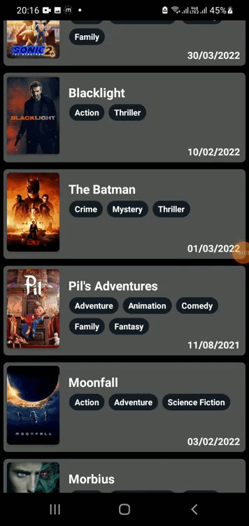

[apk]:        https://github.com/SamuelsonEV/WatchNext/releases/
[github]:     https://github.com/SamuelsonEV/WatchNext/releases/
[licence]:    http://www.apache.org/licenses/LICENSE-2.0

[minsdk-badge]:     https://img.shields.io/badge/minSdkVersion-23-0097A7.svg
[license-badge]:    https://img.shields.io/badge/License-Apache_v2.0-0097A7.svg
[platform-badge]:   https://img.shields.io/badge/Platform-Android-0097A7.svg

<!----------------------------------------------------------------------------------------------------->

Watch Next
======

[![platform-badge]][github]
[![minsdk-badge]][github]
[![license-badge]][licence]

Simple app to track and save your TV shows.

This is a work in progress that was made in a hurry using a bit more than a few hours, so please don't be too harsh on it.
   

# About

  
Watch Next is an Android app with open source code that use Movie DB to find information about movies still on cinema. 
Watch Next uses <a href="https://www.themoviedb.org/documentation/api">TMDb API</a> which has a large collection of information about movies, TV shows and actors.
Offering a friendly and intuitive user interface. You can view information such as: overview, images, release dates, genres, etc. You can browse your favourite movies and keep an eye out on them.
  Wanna support me ???   Send me some coffe :coffee:; Wanna hire me !??? Everything is right below :wink:   

## Skills I trained:
- Fetch data from the Internet with theMovieDB API
- Using Flexbox layout so the badges overflow in a natural manner.
- Incorporate libraries to simplify the amount of code you need to write.
- Use adapters and custom list layouts to populate list views with infinite scrolling.
- Use Github Actions to automatically build and release an app on commit or on release.
- Debugging an application so that it looks and feels natural on the latest Android operating system without losing compatibility.
- Use Github Actions with Github Secrets to implant the API_Key while building the apk, while avoiding exposing it in a public repository.

## Image Samples

  
### [Click here to Download !!!!](https://github.com/SamuelsonEV/WatchNext/releases/)
  

  
## Build instructions:
Since this is a public repository, I removed the API_KEY, so to build it, you need to insert a new one on it. (The [APK Releases](https://github.com/SamuelsonEV/WatchNext/releases/) already have an API KEY and just works !!! :).

To build it yourself, just follow the steps:

1. Register at [TMDb](https://www.themoviedb.org/signup) than get an [API KEY](https://www.themoviedb.org/settings/api)
2. Insert the API_KEY in the file **/app/src/main/java/io/github/samuelsonev/watchnext/MainActivity.java** where it says <<<<INSERT API KEY HERE !!!!!!!!!!!!!!!!!!!!!!!!!!!!!>>>>
3. Use Gradle to build it normally :)

## License

This work by [Samuelson Esteves Vieira](https://github.com/SamuelsonEV) is licensed under the [Apache License 2.0](http://www.apache.org/licenses/LICENSE-2.0).

[Contributors](https://github.com/SamuelsonEV/WatchNext/graphs/contributors) and changes are tracked by Git.

Do not just copy, make it better.
      

